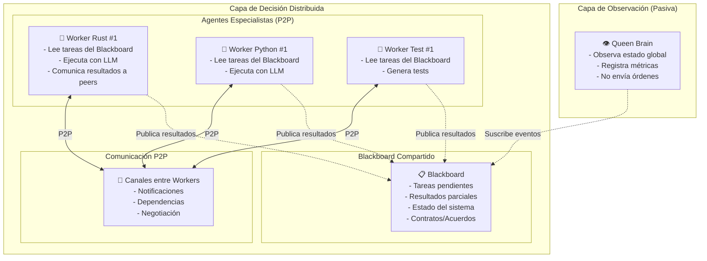
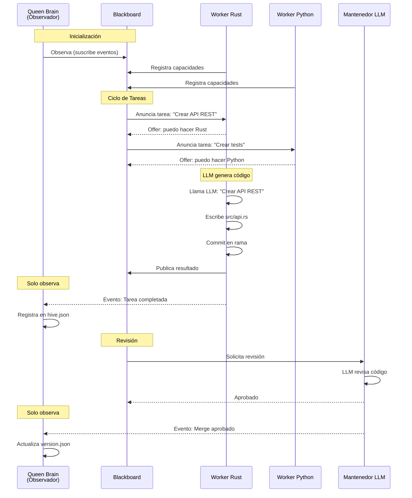

# The Hive - Plan de Arquitectura Mejorada

## Estado Actual vs Estado Deseado

| Componente | Actual | Deseado |
|-----------|--------|---------|
| Código generado | Markdown (.md) | Código real (.rs, .py, etc.) |
| Merge Requests | Simulados | Git local real (git2) |
| Consejo/Mantenedor | Reglas fijas | LLM con contexto |
| Paralelismo | 1 tarea a la vez | N tareas concurrentes |
| Agente "Cerebro" | No existe | Genera código con LLM |

---

## Nueva Arquitectura: Sistema Multi-Agente con LLM

### Diagrama de Componentes



---

## Componentes Nuevos

### 1. El Cerebro (Queen Brain) - `src/brain.rs`

**Rol**: Observador pasivo. Solo monitorea y registra.

```rust
// Responsibilities:
// - Subscribe to all worker events via channels
// - Log decisions to hive.json (decision tree)
// - Record metrics (cycles, approvals, rejections)
// - Update version history on successful merges
// - NEVER send commands to workers

pub struct QueenBrain {
    event_rx: mpsc::Receiver<WorkerEvent>,
    metrics: Arc<Mutex<Metrics>>,
}

impl QueenBrain {
    pub async fn run(&mut self) {
        loop {
            match self.event_rx.recv().await {
                Ok(event) => self.process_event(event),
                Err(_) => break, // Channel closed
            }
        }
    }
    
    fn process_event(&mut self, event: WorkerEvent) {
        match event {
            WorkerEvent::TaskCreated { .. } => { /* log */ }
            WorkerEvent::TaskCompleted { .. } => { /* log */ }
            WorkerEvent::MergeApproved { .. } => { /* update version */ }
            WorkerEvent::MergeRejected { .. } => { /* log rejection */ }
        }
    }
}
```

### 2. Blackboard Compartido - `src/blackboard.rs`

**Rol**: Fuente de verdad compartida. Todos los agentes leen/escriben.

```rust
use tokio::sync::RwLock;
use std::collections::HashMap;

pub struct Blackboard {
    pending_tasks: RwLock<Vec<Task>>,
    completed_tasks: RwLock<Vec<TaskResult>>,
    task_dependencies: RwLock<HashMap<TaskId, Vec<TaskId>>>,
}

#[derive(Debug, Clone)]
pub struct Task {
    pub id: Uuid,
    pub description: String,        // "Crear función foo() en bar.rs"
    pub target_file: PathBuf,       // "src/bar.rs"
    pub specialist_type: Specialist, // Rust, Python, etc.
    pub priority: u8,
    pub dependencies: Vec<TaskId>,
    pub created_by: Uuid,           // Which agent created this
}

#[derive(Debug, Clone)]
pub struct TaskResult {
    pub task_id: Uuid,
    pub success: bool,
    pub changes: Vec<FileChange>,
    pub llm_prompt_used: String,
    pub llm_response: String,
}

#[derive(Debug, Clone)]
pub struct FileChange {
    pub path: PathBuf,
    pub diff: String,
    pub created: bool,
    pub modified: bool,
}
```

### 3. Protocolo de Comunicación P2P - `src/p2p.rs`

**Rol**: Agentes se comunican directamente (no vía Reina).

```rust
// Contract Net-like protocol for task distribution
pub struct P2PProtocol {
    task_offers: mpsc::Sender<TaskOffer>,
    task_bids: mpsc::Sender<TaskBid>,
    task_results: mpsc::Sender<TaskResult>,
}

#[derive(Debug)]
pub struct TaskOffer {
    pub task_id: Uuid,
    pub specialist_type: Specialist,
    pub capabilities: Vec<String>,
}

#[derive(Debug)]
pub struct TaskBid {
    pub task_id: Uuid,
    pub worker_id: Uuid,
    pub estimated_cost: u32,
}

#[derive(Debug)]
pub enum P2PMessage {
    Announce(TaskOffer),
    Bid(TaskBid),
    Accept { task_id: Uuid, worker_id: Uuid },
    Reject { task_id: Uuid, worker_id: Uuid },
    Result(TaskResult),
    DependencyNotification { from: Uuid, to: Uuid },
}
```

### 4. Worker con LLM - `src/worker_llm.rs`

**Rol**: Genera código real usando LLM.

```rust
pub struct LLMWorker {
    id: Uuid,
    specialist: SpecialistProfile,
    llm_client: Box<dyn LLMClient>,  // OpenAI, Anthropic, Ollama, etc.
    blackboard: Arc<Blackboard>,
    git_manager: GitManager,
}

impl LLMWorker {
    pub async fn process_task(&mut self, task: Task) -> Result<TaskResult> {
        // 1. Read context from blackboard (other completed tasks)
        let context = self.blackboard.get_relevant_context(&task).await?;
        
        // 2. Build LLM prompt with context
        let prompt = self.build_prompt(&task, &context);
        
        // 3. Call LLM
        let response = self.llm_client.complete(&prompt).await?;
        
        // 4. Parse response into file changes
        let changes = self.parse_llm_response(&response)?;
        
        // 5. Apply changes to filesystem
        for change in &changes {
            self.apply_change(change).await?;
        }
        
        // 6. Commit to git branch
        self.commit_changes(&task, &changes)?;
        
        // 7. Publish result to blackboard
        self.blackboard.publish_result(TaskResult {
            task_id: task.id,
            success: true,
            changes,
            llm_prompt_used: prompt,
            llm_response: response,
        }).await;
        
        Ok(result)
    }
    
    fn build_prompt(&self, task: &Task, context: &[TaskResult]) -> String {
        let mut prompt = format!(
            "Eres un programador {} experto.\n\n\
            TAREA: {}\n\n\
            ARCHIVO OBJETIVO: {}\n\n",
            self.specialist.language, task.description, task.target_file
        );
        
        if !context.is_empty() {
            prompt += "\nCONTEXTO (tareas relacionadas ya completadas):\n";
            for ctx in context {
                prompt += &format!("- {} -> {:?}\n", ctx.task_id, ctx.changes);
            }
        }
        
        prompt += "\nGenera el código completo para implementar la tarea.";
        prompt
    }
}
```

### 5. Mantenedor LLM - `src/council_llm.rs`

**Rol**: Revisa código con LLM (no reglas fijas).

```rust
pub struct LLMReviewer {
    llm_client: Box<dyn LLMClient>,
}

impl LLMReviewer {
    pub async fn review(&self, mr: &MergeRequest) -> ReviewDecision {
        // Build prompt with code changes
        let prompt = format!(
            "Eres un mantenedor de código senior.\n\n\
            TÍTULO: {}\n\n\
            DESCRIPCIÓN: {}\n\n\
            CAMBIOS:\n{}\n\n\
            Revisa el código y responde:\n\
            1. ¿El código es correcto?\n\
            2. ¿Sigue las mejores prácticas?\n\
            3. ¿Aprobar o rechazar?\n\
            4. Si rechazas, explica por qué y qué cambiar.",
            mr.title, mr.description, mr.get_diff_summary()
        );
        
        let response = self.llm_client.complete(&prompt).await?;
        self.parse_review_response(&response)
    }
}
```

---

## Flujo de Ejecución Mejorado



---

## Configuración de LLM

```toml
# hive.toml
[llm]
provider = "ollama"  # or "openai", "anthropic"
model = "codellama:13b"
base_url = "http://localhost:11434"

[llm.ollama]
timeout_secs = 120

[llm.openai]
api_key = "${OPENAI_API_KEY}"
model = "gpt-4-turbo"

[workers]
max_concurrent = 5
default_specialists = ["rust", "python", "test"]

[blackboard]
max_pending_tasks = 50
task_retention_hours = 24
```

---

## Dependencias a Agregar en Cargo.toml

```toml
[dependencies]
# LLM Clients
reqwest = { version = "0.12", features = ["json"] }
tokio = { version = "1", features = ["full"] }

# Para parsing de código
syn = "2"
quote = "1"

# Para manejo de markdown en respuestas LLM
pulldown-cmark = "0.12"

# Para diffs
similar = "2"
```

---

## Pasos de Implementación

1. **Fase 1: Blackboard + Eventos**
   - Crear `blackboard.rs` con RwLock
   - Crear sistema de eventos WorkerEvent
   - Modificar Queen para que sea observador pasivo

2. **Fase 2: Worker LLM básico**
   - Crear `worker_llm.rs`
   - Implementar cliente LLM (Ollama por defecto)
   - Parseo de respuestas LLM a FileChanges

3. **Fase 3: P2P Protocol**
   - Crear `p2p.rs`
   - Implementar announcement/bid/accept
   - Workers se auto-asignan tareas

4. **Fase 4: Mantenedor LLM**
   - Crear `council_llm.rs`
   - Integrar revisión con LLM
   - Mantener historial de decisiones

5. **Fase 5: Git Local Real**
   - Mejorar `git_manager.rs` para crear ramas reales
   - Aplicar diffs de FileChanges
   - Crear MR locales (stash/branch/commit)

---

## Métricas a Registrar

```json
{
  "metrics": {
    "cycles_completed": 0,
    "tasks_created": 0,
    "tasks_completed": 0,
    "tasks_failed": 0,
    "llm_calls": 0,
    "llm_tokens_used": 0,
    "average_cycle_duration_secs": 0,
    "workers_active": 0,
    "concurrent_tasks": 0
  }
}
```

---

## Notas Importantes

1. **Queen NO envía tareas**: Los workers leen del Blackboard y se auto-asignan
2. **Queen NO decide**: Solo observa eventos y registra
3. **LLM genera código real**: No markdown, sino archivos .rs, .py, etc.
4. **Paralelismo real**: Tokio spawn N workers concurrently
5. **Git local completo**: Cada worker trabaja en su rama, merge a main al aprobar